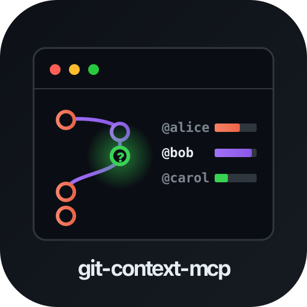

<p align="center">
  
</p>

# git-insight-mcp

[](https://glama.ai/mcp/servers/HasanJahidul/git-insight-mcp)
[](https://github.com/HasanJahidul/git-insight-mcp/actions/workflows/ci.yml)
[](https://www.npmjs.com/package/git-insight-mcp)
[](LICENSE)

Semantic git queries via MCP. Beyond `git log` — answer who/what/when/why about any line, file, or branch.


Pairs with [terminal-history-mcp](https://github.com/HasanJahidul/terminal-history-mcp) and [localhost-mcp](https://github.com/HasanJahidul/localhost-mcp). Together: what you ran, what's running, what you changed.

## Why

Devs ask these constantly; `git` answers poorly:

- "Who last touched this function?" — `git blame` only gives lines, not authors-by-region
- "What PR introduced this line?" — manual: blame → commit SHA → search GH
- "Which files always change together?" — no built-in
- "Show unmerged branches older than 30 days" — bash one-liner gymnastics
- "What did I work on last week?" — manual log scrub

LLM agents need this context to make safe edits. Currently they `git log -n 5` and miss everything.

## Install

```bash
npm install -g git-insight-mcp
```

Wire into Claude Code:

```bash
claude mcp add --scope user git-insight -- git-insight-mcp
```

Or any MCP-compatible client. Runs as a stdio MCP server.

For PR / issue lookups, set a GitHub token:

```bash
export GH_TOKEN=ghp_...
```

Without a token, the local-git tools still work. PR linkage is skipped.

## Tools

| Tool | Purpose |
|------|---------|
| `who_touched` | Group blame by author. Lines, commits, last-touched, primary owner. Optional line-range narrowing. |
| `introducing_pr` | Find the PR that introduced a line (or commit). Parses merge messages first; falls back to GitHub API. |
| `co_change` | Files most often changed together with the input file. |
| `branch_hygiene` | List branches with ahead/behind, last commit, merged status, stale flag. |
| `recent_work` | Standup helper: author's commits + files + ins/del in a window. |
| `commit_context` | Full commit context: subject, body, files, PR, related issues. |

## Sample output (`who_touched`)

```json
{
  "file": "src/auth.ts",
  "total_lines": 124,
  "authors": [
    { "name": "alice", "email": "alice@x.com", "lines": 87, "commits": 12, "last_commit_date": "2026-04-12T10:33:01.000Z" },
    { "name": "bob", "email": "bob@x.com", "lines": 37, "commits": 4, "last_commit_date": "2026-01-03T18:14:55.000Z" }
  ],
  "primary_owner": "alice"
}
```

## CLI usage (sanity checks)

```bash
git-insight-mcp who-touched src/auth.ts
git-insight-mcp co-change src/auth.ts
git-insight-mcp branches
git-insight-mcp recent alice
git-insight-mcp commit a3e577e
git-insight-mcp intro-pr src/auth.ts:42
git-insight-mcp intro-pr a3e577e
git-insight-mcp                # MCP stdio server
```

## Build from source

```bash
git clone https://github.com/HasanJahidul/git-insight-mcp.git
cd git-insight-mcp
npm install
npm run build
node dist/cli.js branches
```

## Limits (v0.1)

- GitHub only (no GitLab/Bitbucket yet).
- `co_change` is O(window × files-per-commit) — defaults capped at 1000 commits.
- Function-level blame is by line range, not AST. Renames not yet tracked.
- GH API rate limit applies (5000/h authed). PR results uncached this version.

## License

MIT
